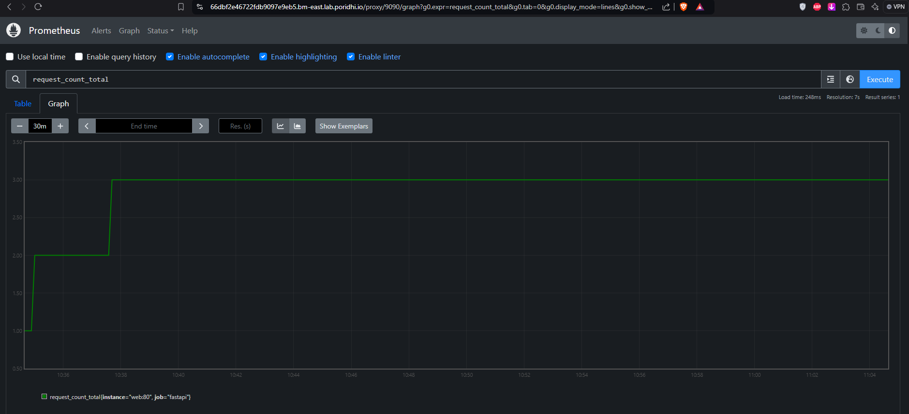

# **FastAPI with Prometheus Monitoring and Load Testing using k6**

This comprehensive guide will walk you through setting up a FastAPI application integrated with Prometheus monitoring and then using `k6` for load testing. You will learn how to create a simple FastAPI application, expose metrics to Prometheus, and test your API performance with `k6`.

## **Project Structure**

Before we begin, let's outline the structure of the project files and folders. The directory will be organized as follows:

```
/project
  /app
    main.py
  Dockerfile
  docker-compose.yml
  requirements.txt
  prometheus.yml
```

### **Explanation:**
- **`/app/main.py`**: Contains the FastAPI application code.
- **`Dockerfile`**: Used to create the Docker image for the FastAPI application.
- **`docker-compose.yml`**: Configures Docker Compose services for the FastAPI app and Prometheus.
- **`requirements.txt`**: Lists the Python dependencies required for the FastAPI app.
- **`prometheus.yml`**: Configuration file for Prometheus to define scrape targets and intervals.

---

## **Step 1: Create the FastAPI Application**

Create a file named `app/main.py` and add the following code:

```python
from fastapi import FastAPI, HTTPException
from prometheus_client import Counter, Gauge, generate_latest
from prometheus_client.exposition import CONTENT_TYPE_LATEST
from starlette.responses import Response
import time

app = FastAPI()

# Prometheus metrics
REQUEST_COUNT = Counter('request_count', 'Total GET request count')
POST_REQUEST_COUNT = Counter('post_request_count', 'Total POST request count')
RANDOM_GAUGE = Gauge('random_gauge', 'A random gauge value')

@app.get("/")
async def root():
    REQUEST_COUNT.inc()  # Increment the GET request counter
    RANDOM_GAUGE.set(time.time() % 60)  # Set gauge to current seconds of the minute
    return {"message": "Hello World"}

@app.post("/submit")
async def submit(data: dict):
    """
    POST endpoint that accepts a JSON payload and returns it back.
    """
    if not data:
        raise HTTPException(status_code=400, detail="No data provided")
    POST_REQUEST_COUNT.inc()  # Increment the POST request counter
    return {"received_data": data}

@app.get("/metrics")
async def metrics():
    return Response(generate_latest(), media_type=CONTENT_TYPE_LATEST)
```

### **Explanation:**
1. **Metrics Defined**:
   - `REQUEST_COUNT`: Counter metric for the total number of GET requests.
   - `POST_REQUEST_COUNT`: Counter metric for the total number of POST requests.
   - `RANDOM_GAUGE`: Gauge metric that holds a value based on the current seconds of the minute.

2. **Endpoints**:
   - `/`: Increments the GET request counter and sets a gauge value.
   - `/submit`: Accepts JSON data via POST request and increments the POST request counter.
   - `/metrics`: Exposes the defined Prometheus metrics.

---

## **Step 2: Create the Dockerfile**

Create a `Dockerfile` in the project root with the following content:

```dockerfile
FROM python:3.9

WORKDIR /code

COPY ./requirements.txt /code/requirements.txt

RUN pip install --no-cache-dir --upgrade -r /code/requirements.txt

COPY ./app /code/app

CMD ["uvicorn", "app.main:app", "--host", "0.0.0.0", "--port", "80"]
```

### **Explanation:**
- **Base Image**: Uses `python:3.9` as the base image.
- **Install Dependencies**: Copies `requirements.txt` and installs dependencies.
- **Copy Application Files**: Copies the application code to the Docker container.
- **Start Command**: Runs the FastAPI app using `uvicorn` on port 80.

---

## **Step 3: Create the Docker Compose File**

Create a `docker-compose.yml` file in the project root directory:

```yaml
version: "3.8"

services:
  web:
    build: .
    ports:
      - "8000:80"
    volumes:
      - ./app:/code/app

  prometheus:
    image: prom/prometheus
    ports:
      - "9090:9090"
    volumes:
      - ./prometheus.yml:/etc/prometheus/prometheus.yml
    command:
      - '--config.file=/etc/prometheus/prometheus.yml'
```

### **Explanation:**
- Defines two services:
  - **`web`**: FastAPI app service. Builds the app from the current directory and runs on port `8000`.
  - **`prometheus`**: Prometheus server service. Maps the Prometheus configuration file and runs on port `9090`.

---

## **Step 4: Define Dependencies**

Create a `requirements.txt` file in the project root directory:

```
fastapi==0.68.0
uvicorn==0.15.0
prometheus-client==0.11.0
```

### **Explanation:**
- **`fastapi`**: Framework for building APIs.
- **`uvicorn`**: ASGI server for serving FastAPI applications.
- **`prometheus-client`**: Library to expose metrics to Prometheus.

---

## **Step 5: Configure Prometheus**

Create a `prometheus.yml` file in the project root directory:

```yaml
global:
  scrape_interval: 15s

scrape_configs:
  - job_name: 'fastapi'
    static_configs:
      - targets: ['web:80']
```

### **Explanation:**
- **`scrape_interval`**: Specifies that Prometheus should scrape metrics every 15 seconds.
- **`scrape_configs`**: Configures Prometheus to scrape metrics from the FastAPI service (`web:80`).

---

## **Step 6: Build and Run the Application**

Run the following command to build and start the application using Docker Compose:

```bash
docker-compose up --build -d
```

### **Explanation:**
- **`docker-compose up --build`**: Builds the Docker image and starts both the FastAPI app and Prometheus server.

---

## **Step 7: Accessing the Application and Metrics**

- **FastAPI Application**: Accessible at [http://localhost:8000](http://localhost:8000)
- **Prometheus UI**: Accessible at [http://localhost:9090](http://localhost:9090)

- **Metrics Endpoint**: You can view the exposed metrics directly at [http://localhost:8000/metrics](http://localhost:8000/metrics).

---

## **Step 8: Install `k6` for Load Testing**

Since `k6` is not available in the default Ubuntu repositories, follow these steps to install `k6`:

### **Add the k6 APT Repository**

```bash
sudo apt-get update
sudo apt-get install -y gnupg software-properties-common ca-certificates curl apt-transport-https
curl -s https://dl.k6.io/key.gpg | sudo apt-key add -
echo "deb https://dl.k6.io/deb stable main" | sudo tee /etc/apt/sources.list.d/k6.list
```

### **Install k6**

```bash
sudo apt-get update
sudo apt-get install -y k6
```

### **Verify Installation**

Run `k6 version` to verify the installation:

```bash
k6 version
```

---

## **Step 9: Create a k6 Load Testing Script**

Create a file named `Test/load-test.js` and add the following content:

```javascript
import http from 'k6/http';
import { check, sleep } from 'k6';
import { Counter } from 'k6/metrics';

// Custom metrics
const postRequests = new Counter('post_requests');

export let options = {
  vus: 10, // 10 virtual users
  duration: '30s', // Test duration of 30 seconds
};

export default function () {
  // Make a POST request to the /submit endpoint
  let url = 'http://localhost:8000/submit';
  let payload = JSON.stringify({ name: 'John Doe', age: 30 });
  let params = { headers: { 'Content-Type': 'application/json' } };

  // Send the POST request
  let res = http.post(url, payload, params);

  // Track POST requests
  postRequests.add(1);

  // Check that the response status is 200
  check(res, { 'status is 200': (r) => r.status === 200 });

  // Pause for a moment between requests
  sleep(1);
}
```

### **Explanation:**
- **Virtual Users (`vus`)**: Runs 10 virtual users concurrently.
- **Duration**: The test runs for 30 seconds.
- **POST Request**: Each user sends a POST request to the `/submit` endpoint with a JSON payload.

---

## **Step 10: Run the Load Test**

Execute the following command to run the load test:

```bash
k6 run load-test.js
```


### **Output:**
`k6` will provide detailed output of the test results, including:
- Total number of requests made.
- Response times and status codes.
- Any errors or failed checks.

---

## **Step 11: Analyze the Metrics in Prometheus**

After running the load test, follow these steps to analyze the metrics in the Prometheus UI:

### **1. Verify Prometheus Target Status**

1. Open the Prometheus UI by navigating to [http://localhost:9090](http://localhost:9090) in your browser.
2. Click on the **"Status"** tab in the top menu and select **"Targets"**.
3. You should see a target named `fastapi` with the URL `web:80`. The `UP` status indicates that Prometheus is successfully scraping metrics from the FastAPI application.

   

### **2. Query Metrics in the Prometheus UI**

Once you've confirmed the target is active, proceed to the **"Graph"** tab:

1. Click on the **"Graph"** tab at the top of the Prometheus UI.
2. In the query bar, type the following queries one by one and click on the **"Execute"** button to visualize the metrics.

#### **Total GET Requests Count**

```prometheus
request_count_total
```
This query will display the total number of GET requests made to the `/` endpoint.


If you switch to `Graph` you will see the request in a visual mode


#### **Total POST Requests Count**

```prometheus
post_request_count_total
```
This query will show the total number of POST requests made to the `/submit` endpoint.


If you switch to `Graph` you will see the `post` request in a visual mode


#### **Request Rate of POST Requests Over the Last 1 Minute**

```prometheus
rate(post_request_count_total[1m])
```

This query displays the rate of POST requests over the last 1 minute. It helps you analyze how frequently the POST endpoint is being accessed during that time frame.


### **3. Visualize the Metrics**

1. For each query, you can select either **"Graph"** or **"Table"** view to display the data in different formats.
2. In the **"Graph"** view, you can see how the metrics change over time, which is useful for monitoring trends and spotting anomalies.
3. In the **"Table"** view, you can see the latest values of each metric, providing an immediate snapshot of your application’s status.


## **Conclusion**

You have successfully:

1. Built a FastAPI application that exposes Prometheus metrics.
2. Configured Docker and Prometheus to scrape these metrics.
3. Set up `k6` for load testing your API.
4. Monitored and analyzed the collected metrics.

This setup provides a complete framework for monitoring and performance testing your FastAPI applications. For further exploration, consider adding more complex metrics, setting up Grafana for visualization, and implementing alerting based on your metrics. Happy coding and monitoring!